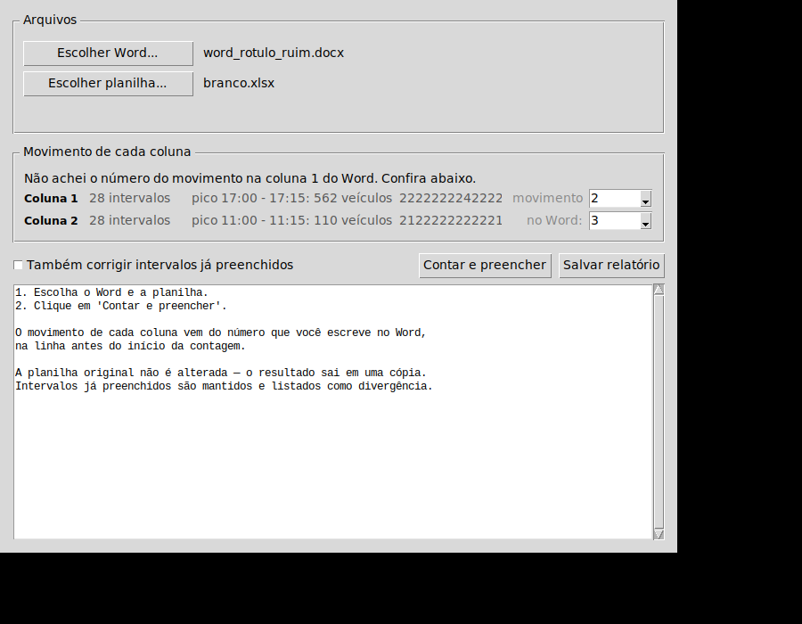

# Contagem Volumétrica — Word → Excel

Conta as sequências de dígitos digitadas no Word durante a contagem de tráfego
e preenche as colunas **Leve / Ônibus / Caminhão / Moto** da planilha do posto,
uma aba por movimento.



## O problema que ele resolve

O pesquisador assiste ao vídeo e digita um dígito por veículo, na ordem em que
passam:

```
6:00 - 6:15   2224223422222222222222222222223425222...
```

| dígito | veículo |
|:---:|---|
| `1` | moto |
| `2` | leve |
| `3` | ônibus |
| `4` | caminhão |
| `5` | articulado — somado dentro de caminhão |

Contar isso à mão e transcrever para a planilha é lento e erra. Na validação
inicial, **27 de 56 intervalos** de um posto real estavam com o total errado na
planilha preenchida manualmente.

## Instalação

No computador do usuário, abra o **PowerShell** e cole esta linha:

```powershell
irm https://raw.githubusercontent.com/joaogavadev/contagem-volumetrica/main/instalar.ps1 | iex
```

Ela instala o Python se precisar, baixa o programa e cria o atalho na Área de
Trabalho. Não precisa de administrador. **Rodar a mesma linha de novo atualiza
o programa** para a última versão do repositório.

Não há bibliotecas para instalar: o `main.py` usa apenas a biblioteca padrão
do Python. No Linux, a interface precisa do Tkinter (`sudo apt install python3-tk`).

## Uso

Abra pelo atalho **Contagem Volumétrica** na Área de Trabalho, ou:

```
python main.py
```

1. Escolher o Word
2. Escolher a planilha
3. Contar e preencher

O movimento de cada coluna sai do **número solto escrito na primeira linha
preenchida** do Word, antes do início da contagem. Se ele não bater com
nenhuma aba da planilha, o programa pergunta em vez de chutar.

### Sem interface

```
python main.py --cli contagem.docx planilha.xlsx saida.xlsx
python main.py --cli contagem.docx planilha.xlsx 2,3 saida.xlsx --sobrescrever
```

## Garantias

- **A planilha original nunca é alterada** — o resultado sai em uma cópia.
- Escreve **apenas as células C:F** de cada linha. Fórmulas de salto e de
  expansão, imagens, formatação condicional e as demais abas ficam intactas
  (a cópia altera 3 arquivos internos do `.xlsx`; as imagens saem byte a byte
  idênticas).
- Marca a planilha para **recalcular ao abrir**, então totais e bloco expandido
  já vêm certos.
- **Não sobrescreve intervalo já preenchido.** Divergências vão para o
  relatório; para corrigi-las, use `--sobrescrever` ou a caixa na janela.
- Intervalos vazios no Word ficam vazios na planilha — o próprio Excel
  interpola esses quartos de hora como média dos vizinhos.

## Relatório

Sai na janela e pode ser salvo em `.txt`:

- intervalos preenchidos e total por tipo de veículo;
- **divergências** entre a contagem real e o que já estava digitado;
- **avisos** — caracteres inválidos, células com quebra de linha, intervalos
  com pouquíssimos veículos, movimento escolhido diferente do marcado no Word;
- **erros** — intervalos que existem no Word mas não na planilha.

## Como funciona por dentro

Sem dependências externas. O `.docx` e o `.xlsx` são lidos como ZIP e o XML é
processado direto — inclusive na escrita, que é cirúrgica: só as células de
destino são trocadas no XML da aba, preservando o resto do arquivo byte a byte.
É o que permite manter fórmulas e imagens que bibliotecas de planilha
costumam descartar no round-trip.

| arquivo | o que é |
|---|---|
| `main.py` | o programa inteiro — leitura, contagem, escrita e interface |
| `instalar.ps1` | instala o Python, baixa o programa e cria o atalho |
| `executar.bat` | atalho para abrir a janela |

## Requisitos

Python 3.6 ou superior, com Tkinter para a interface gráfica.
